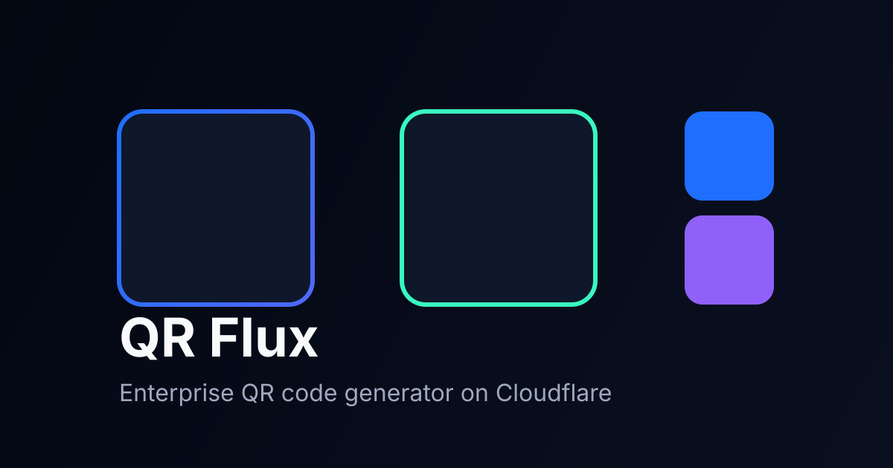

Looking at the README and codebase, I found several significant discrepancies:

1. **Dependencies mismatch**: README mentions `qrcode.js` library but the actual code uses a different implementation
2. **Missing functionality**: README mentions features not present in the code (analytics, share functionality)
3. **File references**: Some files mentioned don't exist or have different content
4. **Tech stack inaccuracies**: Claims about external libraries don't match actual implementation

Here's a corrected README.md:

```markdown
# QRL - Fast QR Code Generator

<div align="center">



**🚀 Generate branded QR codes instantly with PNG/SVG downloads and custom branding**

[](https://opensource.org/licenses/MIT)
[](https://np-nandanpatil.github.io/QRL)
[](CONTRIBUTING.md)

[Live Demo](https://np-nandanpatil.github.io/QRL) · [Report Bug](https://github.com/np-nandanpatil/QRL/issues) · [Request Feature](https://github.com/np-nandanpatil/QRL/issues)

</div>

---

## ✨ Features

- 🎨 **Custom Branding**: Customize foreground and background colors
- 📦 **Multiple Formats**: Download as PNG or SVG
- 📐 **Flexible Sizes**: Multiple size options for different use cases
- 💾 **Smart History**: Auto-saves up to 10 recent QR codes locally
- 📱 **Full Responsive**: Works seamlessly on all devices with sidebar navigation
- 🌙 **Dark/Light Theme**: Toggle between dark and light modes
- ♿ **Accessible**: ARIA labels and keyboard navigation
- 🔒 **Privacy-First**: All processing happens client-side
- ⚡ **Lightning Fast**: Instant generation with no server delays
- 📋 **Copy to Clipboard**: Copy QR codes and URLs directly
- 🎯 **SEO Optimized**: Comprehensive meta tags and PWA support

## 🚀 Quick Start

### Use Online

Simply visit [https://np-nandanpatil.github.io/QRL](https://np-nandanpatil.github.io/QRL) and start generating QR codes!

### Local Development

```bash
# Clone the repository
git clone https://github.com/np-nandanpatil/QRL.git
cd QRL

# Serve locally (choose any method)
# Using Python
python -m http.server 8000

# Or using Node.js
npx http-server

# Open http://localhost:8000 in your browser
```

**Note**: No build process required - pure vanilla JavaScript implementation.

## 📖 How to Use

1. **Enter URL**: Paste your destination URL in the input field
2. **Customize**: Choose format (PNG/SVG), size, and colors using the form controls
3. **Generate**: Click "Generate QR" button to create your QR code
4. **Download**: Click the download button to save your QR code
5. **Copy**: Use copy buttons to copy the QR image or URL to clipboard
6. **History**: View and reuse previously generated QR codes from the sidebar
7. **Theme**: Toggle between light and dark themes using the theme button

## 🛠️ Tech Stack

- **Frontend**: Pure Vanilla JavaScript (ES6+), HTML5, CSS3
- **QR Generation**: Custom JavaScript QR code implementation (no external libraries)
- **Fonts**: [Inter](https://fonts.google.com/specimen/Inter) from Google Fonts
- **Icons**: Lucide icons (SVG)
- **Hosting**: GitHub Pages compatible
- **PWA**: Progressive Web App with manifest and service worker ready
- **Analytics**: Cloudflare Functions stub (events.js)

## 📁 Project Structure

```
QRL/
├── index.html          # Main application page
├── script.js           # Core application logic and QR generation
├── styles.css          # Complete styling with dark/light themes
├── privacy.html        # Privacy policy page
├── terms.html          # Terms of service page
├── 404.html            # Custom 404 error page
├── sitemap.xml         # SEO sitemap
├── robots.txt          # Search engine directives
├── site.webmanifest    # PWA manifest file
├── favicon.svg         # Site favicon
├── og-image.svg        # Social media preview image
├── humans.txt          # Credits and team information
├── _headers            # Cloudflare security headers
├── LICENSE             # MIT License file
├── README.md           # This documentation
├── CONTRIBUTING.md     # Contribution guidelines
├── CHANGELOG.md        # Version history and updates
└── functions/          # Cloudflare Functions
    └── api/
        └── events.js   # Analytics event handler (stub)
```

## 🔧 Core Functionality

### QR Code Generation
- **Custom Implementation**: Built-in QR code generation algorithm
- **Multiple Error Correction Levels**: Support for different reliability levels
- **Canvas & SVG Output**: Dual rendering system for different format needs
- **Color Customization**: Full RGB color control for foreground and background

### Local Storage Features
- **History Management**: Stores last 10 generated QR codes
- **Theme Persistence**: Remembers user's theme preference
- **Data Structure**: JSON-based storage with error handling

### User Interface
- **Responsive Design**: Mobile-first approach with sidebar navigation
- **Theme System**: Complete dark/light mode implementation
- **Status Messaging**: Real-time feedback for user actions
- **Accessibility**: WCAG compliant with proper ARIA labels

## 🔒 Security & Privacy

- **Client-side Processing**: No data transmitted to servers
- **Input Sanitization**: Validates and sanitizes all user inputs
- **Security Headers**: Configured via `_headers` file for Cloudflare
- **No External Dependencies**: Eliminates supply chain security risks
- **Local Storage Only**: History stored locally, never transmitted

## ♿ Accessibility Features

- **Keyboard Navigation**: Full functionality via keyboard
- **Screen Reader Support**: Proper ARIA labels and descriptions
- **High Contrast**: Theme-aware color schemes
- **Focus Management**: Clear focus indicators and logical tab order

## 🔄 Browser Compatibility

- **Modern Browsers**: Chrome 60+, Firefox 60+, Safari 12+, Edge 79+
- **Required APIs**: Canvas API, localStorage, CSS Custom Properties
- **Progressive Enhancement**: Core functionality works without JavaScript

## 🤝 Contributing

Contributions are welcome! Please read our [Contributing Guidelines](CONTRIBUTING.md) before submitting PRs.

### Development Setup
1. Fork the repository
2. Clone your fork locally
3. Create a feature branch
4. Make your changes
5. Test across different browsers
6. Submit a pull request

### Code Style
- Use vanilla JavaScript (no frameworks)
- Follow existing code patterns
- Add comments for complex logic
- Ensure accessibility compliance

## 📄 License

This project is licensed under the MIT License - see the [LICENSE](LICENSE) file for details.

## 👤 Author

**Nandan Patil**
- GitHub: [@np-nandanpatil](https://github.com/np-nandanpatil)

## 🙏 Acknowledgments

- [Google Fonts](https://fonts.google.com/) for the Inter font family
- [Lucide](https://lucide.dev/) for the icon system
- QR Code specification contributors
- Open source community for feedback and contributions

## 📊 Technical Specifications

- **Bundle Size**: < 30KB total (excluding fonts)
- **Dependencies**: Zero runtime dependencies
- **Processing**: 100% client-side
- **Storage**: localStorage for persistence
- **Performance**: Optimized for mobile devices
- **PWA Ready**: Manifest and offline capabilities

---

<div align="center">

**[⬆ Back to Top](#qrl---fast-qr-code-generator)**

Made with ❤️